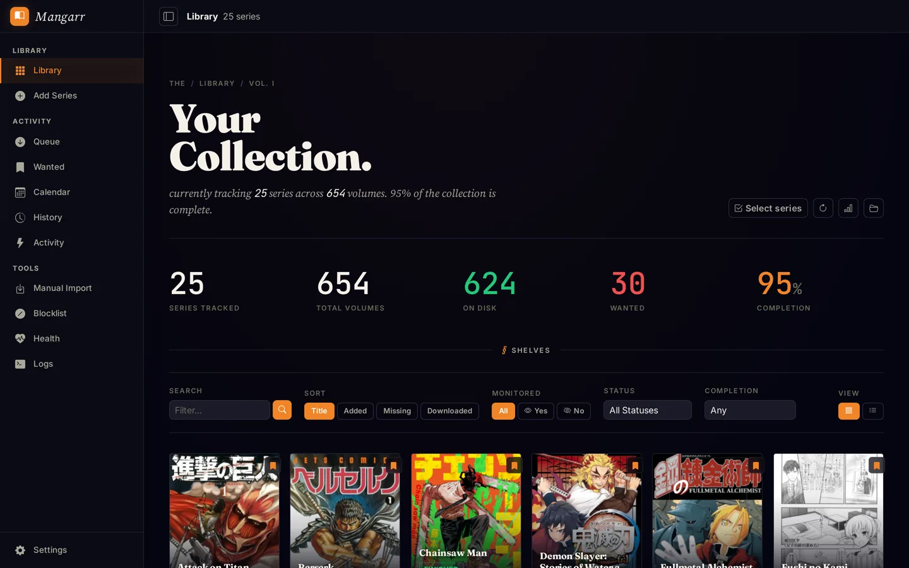

<div align="center">

# Mangarr

**Sonarr-style automation for manga and light-novel libraries.**

[](https://github.com/Kha-kis/manga-arr/releases/latest)
[](https://github.com/Kha-kis/manga-arr/pkgs/container/manga-arr)
[](https://www.python.org/)
[](LICENSE)

[Quick start](#quick-start) · [Features](#features) · [Documentation](#documentation) · [Support](SUPPORT.md)

</div>



Mangarr monitors manga and light-novel series, searches indexers and direct
download sources, sends releases to a download client, and imports completed
files into an organized library. It understands volumes, chapters, editions,
omnibuses, specials, and multi-volume packs instead of treating manga like a
generic TV or book collection.

The current stable release is **1.1.0**. The **1.2.0-rc.1** candidate is
available for operators evaluating the new import-review and metadata
provenance workflows. Mangarr is self-hosted, designed for a single
administrator, and distributed as a multi-platform container image.

## Features

- **Manga-aware monitoring:** volumes, chapters, half chapters, editions,
  omnibuses, specials, one-shots, and packs.
- **Automated acquisition:** RSS and backlog search through Prowlarr, Torznab,
  and Newznab, plus direct-download search and handoff through Suwayomi.
- **Download clients:** qBittorrent and SABnzbd with queue tracking, health
  checks, retry handling, and import handoff.
- **Import pipeline:** automatic and manual import, copy/move/hardlink modes,
  CBZ/CBR handling, split RAR support, duplicate-quality checks, and
  `ComicInfo.xml` metadata.
- **Release control:** quality profiles, custom formats, release profiles,
  delay profiles, language profiles, blocklists, and upgrade cutoffs.
- **Metadata lifecycle:** AniList, MangaDex, MangaUpdates, and Kitsu discovery,
  reconciliation, health reporting, and operator-controlled repair tools.
- **Library operations:** existing-library adoption, rescans, rename previews,
  organization, bulk editing, history, wanted lists, and calendar views.
- **Notifications and media servers:** Komga, Discord, Ntfy, Gotify, Apprise,
  Pushover, Pushbullet, Slack, email, and generic webhooks.
- **Automation API:** native endpoints plus Sonarr-style `/api/v1` and
  `/api/v3` compatibility surfaces.

See the [Sonarr parity inventory](docs/sonarr-parity.md) for the exact
compatibility scope and intentional non-goals.

## How It Works

1. Add a series and choose what Mangarr should monitor.
2. Mangarr searches configured sources or evaluates new RSS releases.
3. Matching releases are scored against profiles and sent to a download
   client.
4. Completed files are validated, staged, named, and imported into the library.
5. Metadata is written, history is recorded, and downstream services are
   notified.

## Quick Start

Requirements: Docker Engine with the Compose plugin. Create a directory for
Mangarr and add this `compose.yaml`:

```yaml
services:
  mangarr:
    image: ghcr.io/kha-kis/manga-arr:latest
    user: "1000:1000"
    environment:
      TZ: Etc/UTC
      MANGARR_UMASK: "0022"
      MANGARR_LIBRARY_PATH: /data/media/manga
      MANGARR_DOWNLOAD_PATH: /data/torrents/manga
      MANGARR_CATEGORY: manga
    volumes:
      - ./config:/config
      - ./data:/data
    ports:
      - "6789:8000"
    restart: unless-stopped
```

Change `user`, `TZ`, and the host sides of the volume mappings directly in the
Compose file when needed. Then start Mangarr:

```bash
mkdir -p config data/media/manga data/torrents/manga
chmod 700 config
docker compose up -d
```

Open `http://<server-ip>:6789`. The first browser visit redirects to
**Create administrator**; submitting that form creates the local account and
signs in immediately. Complete this step before publishing Mangarr through a
reverse proxy or exposing it outside a trusted network.

Configure indexers, download clients, metadata providers, root folders, and
notifications from the Mangarr settings UI. The example is reachable on the
trusted LAN; use an HTTPS reverse proxy before exposing Mangarr beyond it.

### Persistent Paths

| Container path | Purpose |
| --- | --- |
| `/config` | SQLite database, encryption key, cached covers, and backups |
| `/data/media/manga` | Organized manga library in the example Compose layout |
| `/data/torrents/manga` | Completed downloads in the example Compose layout |

Application-created backups contain a consistent SQLite snapshot, the matching
encryption key, and a version manifest. Treat them as sensitive. A stopped
snapshot of the entire `/config` directory remains the strongest pre-upgrade
recovery artifact because it also includes cached covers and rollback files.

## Upgrading

Back up `/config`, then pull the current stable image and recreate the
container. Persistent settings and library state remain in the mounted paths.

If the installation uses Mangarr's public 1.0.x Compose file, replace its
interpolated `image:` line with `ghcr.io/kha-kis/manga-arr:latest` before this
first upgrade. That older file remains pinned by `MANGARR_VERSION` otherwise.
After the Compose file contains direct values and no `${...}` references, its
Mangarr `.env` file is no longer required.

```bash
docker compose pull
docker compose up -d
docker compose ps
```

Verify `/healthz`, System Status, and a representative search/import workflow.
For a version pin or rollback, replace `latest` on the `image:` line with an
exact tag such as `1.0.1`, restore the matching `/config` backup, and run the
same pull and up commands. Do not run an older image against a database migrated
by a newer release. The complete procedure is in
[Deployment and recovery](docs/deployment.md#upgrading-and-rollback).

## Security

- Browser sessions use the local administrator account; integrations use the
  separate API key from **Settings > General**.
- Stored integration credentials are encrypted with the key under `/config`.
- The public Compose file runs without root privileges; browser authentication
  is mandatory after first-run setup.
- Administrator recovery is an offline operation that revokes existing browser
  sessions.

```bash
docker compose exec mangarr mangarr admin reset --yes
```

Report vulnerabilities privately through the process in [SECURITY.md](SECURITY.md).
Never publish API keys, passwords, private tracker URLs, or encryption keys.

## Documentation

| Area | Reference |
| --- | --- |
| Install, networking, backup, upgrade, and recovery | [Deployment and recovery](docs/deployment.md) |
| Supported Sonarr workflows and compatibility limits | [Sonarr parity](docs/sonarr-parity.md) |
| Versioning and release procedure | [Releases and versioning](docs/releases.md) |
| Stable-release acceptance gate | [Release qualification](docs/release-qualification.md) |
| User-visible changes | [Changelog](CHANGELOG.md) |
| Development workflow | [Contributing](CONTRIBUTING.md) |
| Test architecture and commands | [Test guide](tests/README.md) |
| Community expectations | [Code of Conduct](CODE_OF_CONDUCT.md) |

## Development

Mangarr supports Python 3.11 through 3.14 for development and uses Python 3.14
in the release container. Application code lives in `app/`, templates in
`app/templates/`, and tests in `tests/`.

```bash
python3 -m venv .venv
. .venv/bin/activate
python -m pip install -r requirements.txt -r requirements-test.txt
make test
```

Use `make test-release-safe` for changes to routes, templates, authentication,
imports, metadata, or browser workflows. Read [CONTRIBUTING.md](CONTRIBUTING.md)
before opening a pull request.

## Support

Use [GitHub Discussions](https://github.com/Kha-kis/manga-arr/discussions) for
setup and workflow help. Use the
[issue forms](https://github.com/Kha-kis/manga-arr/issues/new/choose) for
reproducible bugs and scoped feature proposals. Support expectations are in
[SUPPORT.md](SUPPORT.md).

## License

Mangarr is licensed under the [GNU Affero General Public License v3.0 only](LICENSE)
(`AGPL-3.0-only`). If you modify Mangarr and make it available to users over a
network, you must offer those users the corresponding source code under the
same license.

Copyright (C) 2026 Kha-kis.
